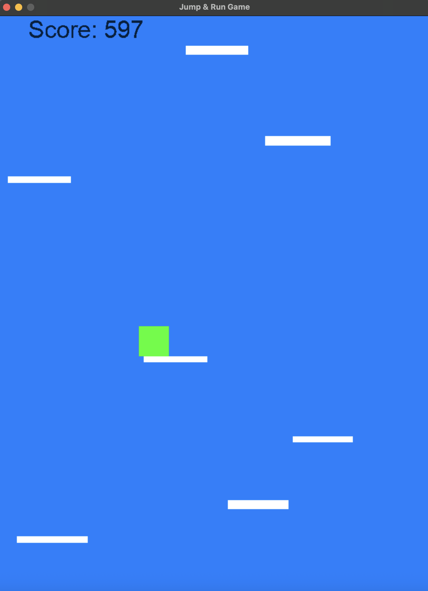

# 🎮 Jump Game

A vertical platformer built in pure C++ and SDL2 - my sandbox for learning game design and C++ development.




---

## 🚀 Why I Built This

This project is my playground for exploring game development from scratch. No game engines, no frameworks - just C++, SDL2, and a curiosity about how games work. It's not meant to be a polished product; it's a **learning sandbox** where I experiment with game physics, interactive simulations, and the challenge of making controls feel *right*.

---

## 🎯 What It Is


A simple vertical jumping game where you control a block trying to reach as high as possible by bouncing on moving platforms. Jump too early or too late, and you'll fall. The challenge is timing your jumps and positioning yourself while the platforms keep moving.

**Core Features:**
- Real-time keyboard input handling
- Physics-based jumping mechanics
- Moving platforms with collision detection
- Score tracking system
- Interactive gameplay loop

---

## ⚙️ Try It Yourself

### Prerequisites

You'll need:
- C++ compiler (g++)
- SDL2 library installed

### Installation

**macOS:**
```bash
brew install sdl2
```

**Linux (Ubuntu/Debian):**
```bash
sudo apt-get install libsdl2-dev
```

### Setup & Compilation

1. Clone this repository:
```bash
git clone https://github.com/yourusername/jump-game.git
cd jump-game
```

2. Update the SDL2 path in `Compile.sh` if needed:
   - Open `compile.sh`
   - Modify the include path to match your SDL2 installation location
   - On macOS with Homebrew, this is typically `/opt/homebrew/include/SDL2` or `/usr/local/include/SDL2`

3. Compile and run:
```bash
bash compile.sh
```

The script will compile the game and automatically launch it.

---

## 🎮 How to Play

| Key | Action |
|-----|--------|
| **SPACE** | Jump |
| **A** | Move Left |
| **D** | Move Right |
| **Close Window** | Quit Game |

**Objective:** Jump from platform to platform, reaching as high as you can. Don't fall off the bottom of the screen!

---

## 💡 What I Learned

Coming from Python, this project taught me a lot about C++ and game development:

### Technical Skills
- **C++ Structure:** Managing header files (`.h`) and implementation files (`.cpp`), understanding the importance of proper file separation
- **Performance Thinking:** How efficient `for` loops can be, and when performance actually matters
- **Object-Oriented Architecture:** Multiple classes interacting with each other - a very different mental model from procedural code

### Game Development Insights
- **Real-Time Simulation:** Creating something that's alive and responsive - capturing keyboard input and updating the screen in real-time was genuinely exciting
- **Game Physics:** What "feels good" vs. what's realistic - game physics is an art, not just science
- **Incremental Development:** Building something interactive piece by piece, testing constantly

### Biggest Surprise
How **simple** it was to create a working game in pure C++! No fancy engine required - just SDL2 for rendering and input, and suddenly you have an interactive simulation running on your screen.

### What I'm Proud Of
The code **works**, and I understand the logic behind it. Managing the interaction between player physics, platform movement, collision detection, and score tracking - it all comes together, and *I built that*.

---

## 🔮 What's Next

I'm planning to expand this project with:

1. **🎯 Starting Screen** - Proper menu with play/restart functionality (HIGH PRIORITY)
2. **🏆 High Score Tracking** - Display best scores on the start screen
3. **🚧 Obstacles** - Add hazards to make gameplay more interesting
4. **🎨 Matrix Transformations** - Screen squish/shear effects for visual flair
5. **✨ Better Graphics** - Upgrade from simple rectangles to actual sprites

---

## 🪟 Platform Notes

**Currently Supported:** macOS and Linux

**Windows:** This project uses bash scripts and Unix-style compilation. Windows setup would require a different approach (MinGW or Visual Studio configuration). I don't have experience with Windows C++ development yet, but if you're a Windows user who gets this working, **PRs are welcome!** 🙌

---

## 📝 Code Organization

The project follows a clean separation pattern:
- Each class has its own `.h` (header) and `.cpp` (implementation) file
- Game logic is modular and expandable
- Main game loop handles rendering, input, and physics updates

This structure makes it easier to add new features without breaking existing code.

---

## 🤝 Contributing

This is a personal learning project, but I'm open to:
- Bug fixes
- Suggestions for better C++ practices
- Windows setup instructions
- Ideas for new features

Feel free to open an issue or PR!

---
